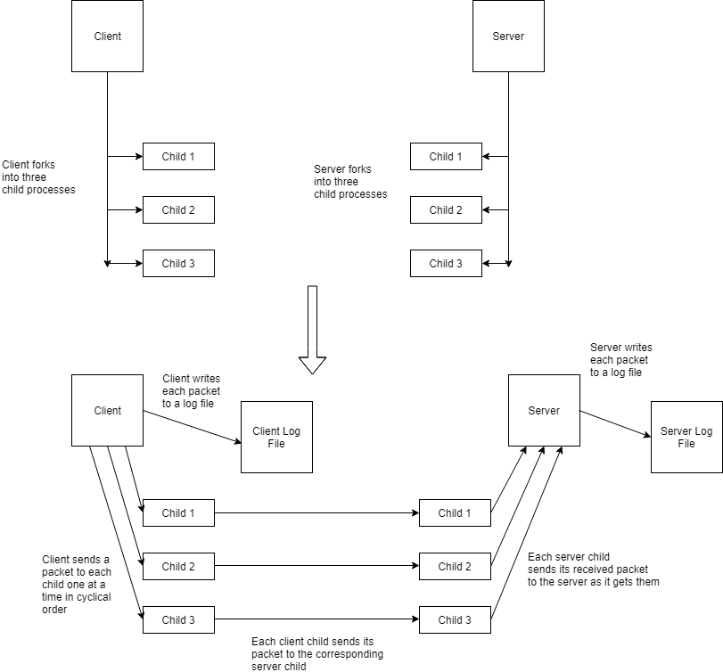

Simplified Multipath TCP Project Report

Tristan Anderson

# 1. Overview of Document

There are four major sections to this document. The first is the design requirements section; it lays out the purpose and intended use of the project. The second is the levels of design, which includes many subcategories pertaining to the functionality of the client-server system. Since this is a protocol for sending information, the protocols section details the way the packets are structured and certain design decisions involving it. The assumptions section lays out a couple of things I took for granted in development that were less specified in the original specifications so that they can be explicitly known.

# 2. Design Requirements

This simplified MPTCP program is designed to send a sequence of characters between a client and the server over more than one (in this case 3) TCP subflow connections. The data the stream to be sent are the ASCII digits from 0 to 9, the ASCII characters from a to z, and the ASCII characters from A to Z. The string of characters was to be sent 16 times while cycling through the various TCP subflows. 

The program can be written in any language, but I chose to write it in C in order to have a little more direct control. As for platform requirements, I chose Linux, but any environment will work as long as it can perform the above functions. While this simplified version of MPTCP is only meant to use a set number of subflows and send a specific message, actual MPTCP is meant to allow a user to send information more quickly than regular TCP by allowing any message being sent to be split and sent over multiple connections. In regards to system requirements, the program can be made very efficient, so these are more dependent on the user’s needs. The users of a program like this could be anyone trying to send messages from a client to a server, and a likely use would be to send large files or things like full videos.

# 3. Levels of Design

This section of the document will outline the different pieces that our project is made up of. The block diagram below (Figure 1) shows the general structure of our project as explained in more detail in 3.1 through 3.2.5.

Figure 1. Block Diagram visually showing  the flow of the project.

## 3.1 The Client 

The client represents one of the two files that were created for this project.

### 3.1.1 Overview

The client has two main functions, creating packets using the given data, and sending those packets to the server. These two functions are accomplished using five distinct modules that are outlined below.

### **3.1.2 Forking Main Function**

The first module of the client revolves around forking the parent process three times to generate the three child processes. This main function also keeps track of the order in which these processes were by storing the process ID of the three children in an array that will be referred to later. After the four processes have been created (3 children and one parent), the processes reach a conditional statement which causes them to enter their respective handlers.

### 3.1.3 Parent Handler

The parent process of the client has three main roles: invokes the packet creation using the data, communication with the child processes to pass along those packets, and writing information about the mapping of the data to a log file. All three of these roles are accomplished simultaneously, i.e. the packet is immediately transferred to the child processes once it is creation. More information on the creation of the packet can be found in section 3.1.5, and more details on how the parent process communicates with the child processes can be found in section 3.1.6.

### 3.1.4 Child Handler

The child process of the client has two main roles: reading the information sent by the parent, and sending that information to the server via a socket connection. These tasks are accomplished simply by reading the packet to a string, and then transmitting that string over the connection. Once the child process has sent all of the packets assigned to it, it closes its connection and exits. More information on how the child process communicates with the parent process can be found in 3.1.6.

### 3.1.5 Packet Creation

Our design for this task was to make a helper function that could be called whenever a packet needs to be made. The parameters of the function include the port number of the child process that it is to be sent over, the subflow sequence number of the child process, the total sequence number, and the data. These pieces of information are then put into their specific spots in the packet as individual bytes.

### 3.1.6 Pipes

The function of the piping in the is to allow communication between the parent and child processes. More specifically, the parent is tasked with making the packets, but the children have to send them. The pipes were utilized in order for the parent to quickly send the packet to the children in the necessary ordering.

## 3.2 The Server

The server represents the second file that was created for this project.

### 3.2.1 Overview

The server has two main functions, receiving the packets sent by the client and both displaying them and writing them to a log file. These two functions are accomplished using the four distinct modules that are outlined below.

### 3.2.2 Forking Main Function

The main function of the server acts very similarly to the main function of the client. More information can be found in section 3.1.2.

### 3.2.3 Parent Handler

The parent process of the server has three main roles: reading packets passed to it by the child processes, reading the packets to calculate the total sequence number using the subflow sequence number and the port number, and writing the mapping of sublow sequence number to total sequence number in a log file. All three of these roles are accomplished simultaneously, i.e. one child process is handled completely before the parent process continues to the next. More details on how the parent process communicates with the child processes can be found in section 3.2.5.

### 3.2.4 Child Handler

The child process of the server has two main roles: reading the information sent over the TCP connections and sending that information to the parent process. These tasks are accomplished simply by reading the transmitted string, and then using the server’s pipes to transmit it to the parent. Once the child process has received the correct number of packets, it closes its connection and exits. More information on how the child process communicates with the parent process can be found in 3.2.5.

### 3.2.5 Pipes

The pipes in the server function very similarly to the client. However, the major difference is that the direction of transmittal is different. In the client, the packets were sent from parent to children, but in the server it is reversed. The children send the received packets to the parent process, which then prints them out and writes to the log file. 

# 4. Protocols

The packet protocol I used includes several parts. The source port number (2 bytes), the subflow sequence number (2 bytes), the total sequence number (2 bytes), and the data itself (4 bytes) were the parts I used in order to specify information in the packet. This information was known to both the client and the server for building and sending the packets, and reading and outputting the packets, respectively. 

Because of the scope of this project, many things were hard-coded, such as the length of the packet, the data, how many times it would be repeated, etc. However, because of the way I modularized our code, it would be pretty simple to, in the future, add in commands for the user to input his or her own data, packet length, etc., and then it would only require a few changes to the control connection to send the data over to the server. 

# 5. Assumptions

One major assumption I made in the course of this project is a lack of errors in packet sending. Essentially, I assumed that no packets would be lost in the course of the communication between the client and server. 

I assumed (and through testing I found it to be true) that I could calculate the total sequence numbers from the information in the packet from the port number and the subflow sequence numbers. The reasons I did this are that it is more efficient compared to sending the data over a connection and in a real world scenario where packets can be lost, this prevents an extra potential for error. The total sequence number was included in the packet information itself, but I decided to calculate it in order to more closely follow the spirit of the assignment.
